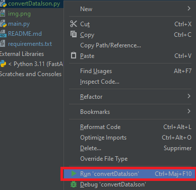
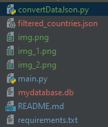
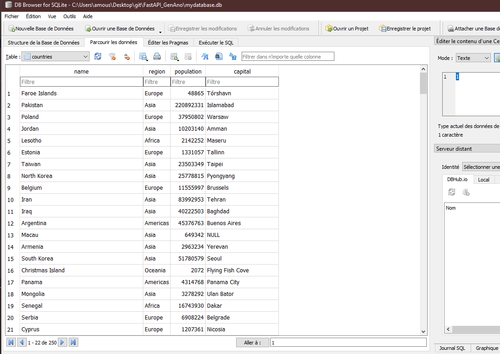
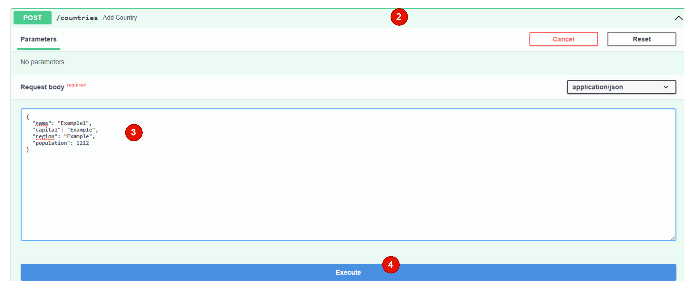
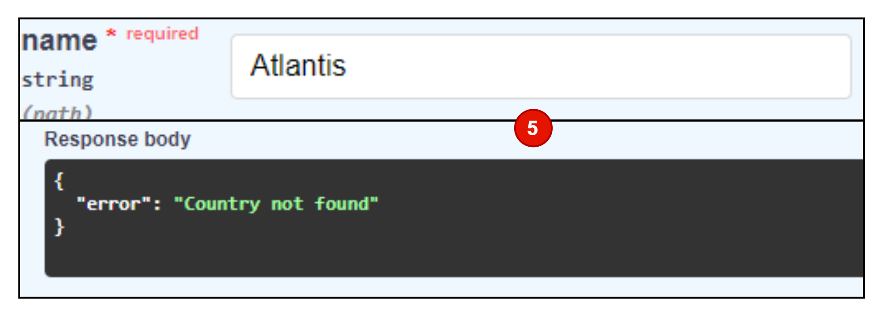
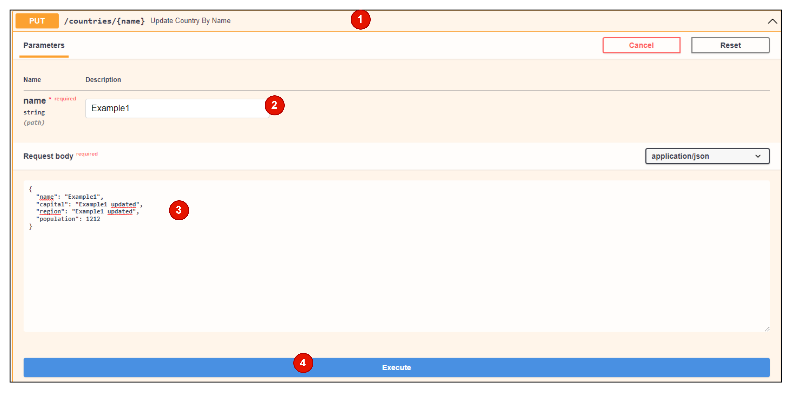

# COUNTRY 
The code uses the SQLite3 database to store and retrieve country data instead of using a JSON file. There is a "countries" table in the database that has the same fields as the Pydantic model. The endpoints to get all countries, get a country by name, get countries by region, add a country, and update a country have been modified to interact with the database. SQL queries are used to execute database operations such as inserting data, selecting data based on search criteria, and updating existing data.

# Creating the database  
first of all before doing anything we should create our database.
we are going to collect countries informations from this website `https://restcountries.com/v3.1/all`, we will clean and just save json file with this format
each country has the following informations name presents the name of the country , capital , region , population 
```json
{
  "name": "Morocco",
  "region": "Africa",
  "population": 36910558,
  "capital": "Rabat"
}
```
after that will create our database and add the data from the json file 
####*DEMO* :
we want to execute the script for creating the database by default we have the main script running when we execute so we want to change to the script that creates the database

    hover over the script file with your mouse right click and press RUN 

    
    we can clearly see the database `mydatabase.db` and json 'filtered_countries.json' have been added


    to view our database we going to use the tool DB Browser for SQLite


# Launching the server in localhost
now that we have the database setup we are ready to launch our server in our case we are using uvicorn

we open the pycharm terminal and run the following command `uvicorn main:app --reload --host 127.0.0.1 --port 8020
`.This command runs the Uvicorn server with the FastAPI application defined in the main module and named app. It listens on `http://127.0.0.1:8020`, automatically reloads the server on code changes, and is only accessible from the same machine.

the result if everything is working fine should be as shown in the image below


# FastAPI Swagger UI

FastAPI comes with built-in support for generating interactive documentation using Swagger UI, which provides a user-friendly interface for exploring and testing your API. Swagger UI is generated automatically based on the metadata included in your code, making it easy to keep your documentation in sync with your codebase.

To access the Swagger UI documentation for FastAPI application, navigate to `http://localhost:8020/docs`


### *GET /Countries*
1. Once the Swagger UI page has loaded, you should see a list of available endpoints. Click on the GET /countries endpoint to expand it. You should see a brief description of what the operation does, which is "Get all countries."
2. In the expanded view, you should see a "Try it out" button. Click on this button to open the request editor.
3. In the request editor, you can modify any query parameters or request headers that the endpoint expects. However, for this endpoint, there are no parameters or headers to modify, so you can skip this step.
4. Click the "Execute" button to send the GET request to the endpoint.
5. After a few moments, you should see the response from the endpoint appear in the "Response body" section below the request editor. The response should be a JSON array of objects, each representing a country and containing the country's name, capital, region, and population


### *POST /Countries*
1. Once the Swagger UI page has loaded, you should see a list of available endpoints. Click on the POST /countries endpoint to expand it.
2. In the expanded view, you should see a "Try it out" button. Click on this button to open the request editor.
3. In the request editor, you should see a Request body section, where you can specify the country you want to add. The request body should be in JSON format and should include the following properties:
   - name: the name of the country (string)
   - capital: the capital city of the country (string)
   - region (optional): the region or continent where the country is located (string)
   - population (optional): the population of the country (integer)
   </br> for example: 
```json
{
  "name": "Example1",
  "region": "Example1",
  "population": 1212,
  "capital": "Example"
}
```
4. Once you have specified the request body, click the "Execute" button to send the POST request to the endpoint.
5. After a few moments, you should see the response from the endpoint appear in the "Response body" section below the request editor. The response should be a JSON object containing a message indicating whether the country was added successfully or an error message if the country already exists.




### *GET /Countries/{name}*
1. Click on the GET /countries/{name} endpoint to expand it, In the expanded view, you should see a "Try it out" button. Click on this button to open the request editor.
2. In the "Path Parameters" section, enter the name of a country that you want to retrieve information for. For example, `Morocco`
3. Click the "Execute" button to send the GET request to the endpoint.
4. After a few moments, you should see the response from the endpoint appear in the "Response body" section below the request editor. The response should be a JSON object representing the country you requested, containing the country's name, capital, region, and population
5. If the country you requested is not found in the database, the response will be a JSON object containing an "error" field with the message "Country not found". For example `Atlantis`




### *PUT /Countries/{name}*
1. Click on the PUT /countries/{name} endpoint to expand it.  In the expanded view, you should see a "Try it out" button. Click on this button to open the request editor.
2. In the `Path parameters` section of the request editor, enter the name of the country you want to update in the `name` field. </br> For example, `Example1`
3. In the `Request body` section, you should see a sample JSON object for the Country model with `name`, `capital`, `region`, and `population` fields. Modify the values of these fields to the updated values for the country you want to update. </br>
```json
{
  "name": "Example1",
  "region": "Example1 update",
  "population": 1212,
  "capital": "Example update"
}
```
4. Click the `Execute` button to send the PUT request to the endpoint. 
5. After a few moments, you should see the response from the endpoint appear in the `Response body` section below the request editor. The response should be a JSON object with a "message" field indicating whether the update was successful or an "error" field if the country was not found.




### *GET /Countries/region/{region}*
1. Click on the GET /countries/region/{region} endpoint to expand it. In the expanded view, you should see a `Try it out` button. Click on this button to open the request editor.
2. In the `region` parameter box, enter the name of the region you want to search for. </br> for example let's search for the example that we created , `Example1 updated`.
3. Click the `Execute` button to send the GET request to the endpoint.
4. After a few moments, you should see the response from the endpoint appear in the `Response body` section below the request editor. The response should be a JSON array of objects.
5. If no countries are found for the specified region, the response will contain an error message indicating that the region was not found.
